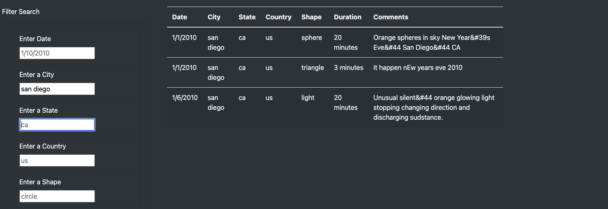
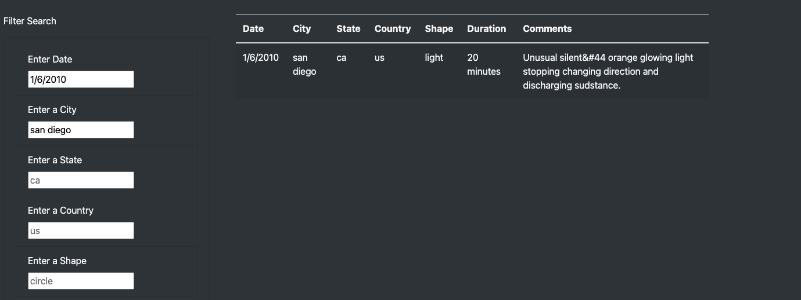

# UFO-Sightings-Visualization-in-JavaScript
Creating a webpage to interact visually with UFO Sightings Data using JavaScript

## Purpose
To create a dynamic webpage that allows users to filter for multiple criteria in a UFO sightings data set.

## Results
The table generation with filters seems responsive to a single input in any of the filters. In this example I input a city  (that was in the data set) into the city input box.

Here is another example with an additional date filter added, also responsive.

## Summary
There are further improvements that can be made on the web page. One of the draw backs is with user input boxes as there are no directions on the use of the input boxes. unguided user generated input can take a variety of forms and it requires more robust code to manipulate that input into usable filters. Especially with a limited data set, such as this (the entire range of dates span about 15 days in January 2010), it maybe better to create a drop down list button with valid inputs for each filter. Also some of the criteria seems redunant; country is not needed as US is the only country in the data set. 
